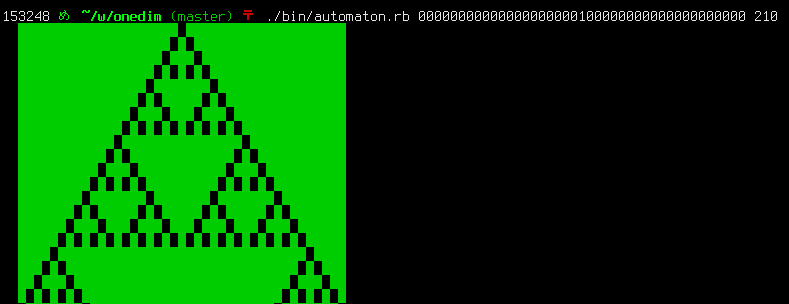

# onedim

A playground for one dimensional, two states, cellular automata.

Built for http://hiroshimarb.github.io/blog/2013/04/06/hiroshimarb-31/

The book that inspired it: http://amzn.to/Z7mXOM (in english: http://amzn.to/16DPcIq ).


## usage

```
  $ git clone git://github.com/jmettraux/onedim.git
  $ ./bin/automaton.rb 000000000000010 110
```

for example:




## presenting

I presented the repository going from the initial commit to the latest commit. to navigate from one commit to the other with a minimum hassle, I used [gmo](misc/gmo) a tiny ruby script wrapping some git commands. Doing ```gmo next``` moves to the next commit. I could thus show the evolution of the development, especially the test first approach and some refactoring.


## credits

* [Akira345](https://github.com/akira345)
* [Eiel](https://github.com/eiel)
* everybody in [hiroshima.rb](https://hiroshimarb.github.io)


## license

MIT

